<div align="center">

<!-- Custom Animated SVG Hero Banner -->
<picture>
  <source srcset="https://raw.githubusercontent.com/Khairul122/Khairul122/main/header.svg"/>
  
</picture>

<br/><br/>

<!-- Dynamic Typing SVG Animation -->
[](https://git.io/typing-svg)

</div>

<br/>

<div align="center">

### 🌐 Connect & Collaborate

[](https://linkedin.com/in/)
[](https://github.com/Khairul122)
[](https://instagram.com/khrl_arll)
[](mailto:khairulhuda242@gmail.com)

</div>

---

## 👨‍💻 About Me

```typescript
const khairul: DeveloperProfile = {
  name: "Khairul Huda",
  status: "Informatics Engineering Student & Developer",
  coreFocus: ["Full Stack Web", "Machine Learning & AI", "Mobile Development"],
  currentStack: ["React/Next.js", "Python/PyTorch", "Flutter", "Laravel/PHP"],
  passions: [
    "Building high-performance web applications",
    "Developing AI-driven solutions",
    "Open source contribution & software craft"
  ],
  motto: "Code today. Innovate tomorrow. 🚀"
};
```

👋 **Halo! Saya Khairul Huda**, mahasiswa **Teknik Informatika** yang berdedikasi membangun aplikasi web modern, sistem berbasis Kecerdasan Buatan (AI/ML), serta aplikasi mobile cross-platform. Saya aktif mengembangkan proyek open-source dan selalu tertarik mengeksplorasi teknologi terbaru.

---

## 📊 Live GitHub Dashboard

> 🔄 *Data statistik di bawah ini diperbarui secara otomatis setiap 5 menit via GitHub Actions.*

<!-- GITHUB-METRICS:START -->
- ⚡ **Recent Commits (7d):** **30**
- 🔀 **PRs Merged (30d):** **22**
- 🎯 **Issues Opened (30d):** **0**
- 📦 **Top Active Repos:** [`Khairul122`](https://github.com/Khairul122/Khairul122) • [`synectra`](https://github.com/Khairul122/synectra) • [`e-commerce-rendang`](https://github.com/Khairul122/e-commerce-rendang) • [`lstm`](https://github.com/Khairul122/lstm) • [`top-up-game-prototipe`](https://github.com/Khairul122/top-up-game-prototipe)
- 🔤 **Languages by Activity:** **HTML, PHP, Dart, Blade, JavaScript**
- 🕒 **Rate Limit Remaining:** **5000** (Resets: `00:09:40 UTC`)
- 🔄 *Last updated: Sat, 29 Aug 2026 23:09:43 GMT*
<!-- GITHUB-METRICS:END -->

---

## ⚡ Tech Stack & Ecosystem

<div align="center">

### 🔤 Programming Languages
[](https://skillicons.dev)

### 💻 Frontend & Web Frameworks
[](https://skillicons.dev)

### ⚙️ Backend & Frameworks
[](https://skillicons.dev)

### 📱 Mobile & AI / Data Science
[](https://skillicons.dev)

### 🗄️ Databases, Cloud & DevOps
[](https://skillicons.dev)

### 🔧 Tools, Editors & Design
[](https://skillicons.dev)

</div>

---

## 🚀 Featured Projects

<div align="center">

| Project | Description | Tech Stack | Stars |
| :--- | :--- | :--- | :---: |
| ⚡ **[Synectra](https://github.com/Khairul122/synectra)** | Integrated workspace & system hub for modern workflows. | `TypeScript` • `React` • `Node.js` |  |
| 🛒 **[E-Commerce Rendang](https://github.com/Khairul122/e-commerce-rendang)** | Full-featured digital store & inventory management platform. | `PHP` • `Laravel` • `MySQL` |  |
| 🎮 **[Top-Up Game Prototype](https://github.com/Khairul122/top-up-game-prototipe)** | Interactive game credits & voucher transaction prototype. | `JavaScript` • `HTML/CSS` |  |
| 🧠 **[LSTM Time Series Model](https://github.com/Khairul122/lstm)** | Deep learning recurrent neural network model for forecasting. | `Python` • `PyTorch` • `Jupyter` |  |

</div>

---

## 📈 GitHub Analytics & Activity

<div align="center">


<br/><br/>

[](https://github.com/Khairul122)

<br/>

[](https://github.com/Khairul122)

</div>

---

## 🏆 Badges & Contribution Snake

<div align="center">

<picture>
  <source type="image/svg+xml" srcset="https://raw.githubusercontent.com/Khairul122/Khairul122/main/trophy.svg"/>
  
</picture>

<br/><br/>

<picture>
  <source media="(prefers-color-scheme: dark)" srcset="https://raw.githubusercontent.com/Khairul122/Khairul122/main/docs/github-contribution-grid-snake-dark.svg"/>
  <source media="(prefers-color-scheme: light)" srcset="https://raw.githubusercontent.com/Khairul122/Khairul122/main/docs/github-contribution-grid-snake.svg"/>
  
</picture>

</div>

---

<div align="center">


</div>
